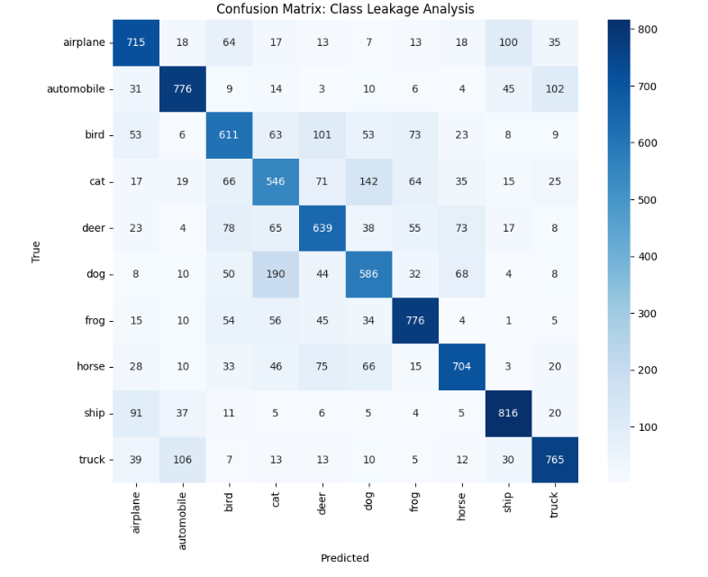
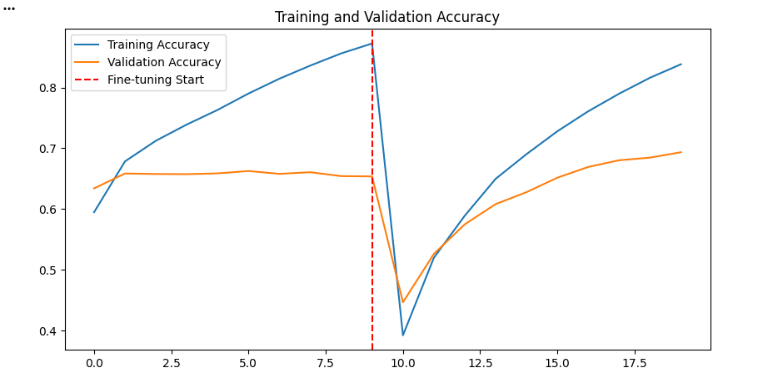

# CIFAR-10 Computer Vision Project: Transfer Learning with ResNet50

## Project Scope
The goal of this project is to perform a 10-class classification task on the **CIFAR-10 dataset**, which consists of 60,000 $32 \times 32$ color images. Unlike the grayscale Fashion MNIST, this dataset introduces complexity through RGB channels and object variety.

## Key Objectives
* **Model Selection:** Leveraging a pre-trained **ResNet50** architecture for transfer learning.
* **Optimization:** Training in two phases—Initial Head Training and Fine-Tuning.
* **Success Metrics:** Monitoring accuracy and analyzing **Class Leakage** between mutually exclusive classes like Automobiles and Trucks.

### 1. Data Acquisition & Downsampling
In this step, we load the CIFAR-10 dataset. To ensure computational efficiency during training, the dataset is downsampled to **10,000 training images**.
* **Constraint Awareness:** While downsampling speeds up the training phase, it may increase the model's variance and risk of overfitting compared to using the full 50,000 training set.

### 2. Exploratory Data Analysis (EDA)
Visual inspection is vital to confirm data integrity. We display random samples from each of the **10 classes** to understand the low-resolution $32 \times 32$ constraints.
* **Observation:** The classes are strictly **mutually exclusive**; for example, "Automobile" covers sedans and SUVs, while "Truck" is reserved for heavy-duty vehicles, excluding pickups.

### 3. Image Preprocessing Logic
We utilize the `preprocess_input` function specifically designed for ResNet50. 
* **Scaling:** Instead of simple division by 255, this method applies mean subtraction based on the original ImageNet dataset distributions.
* **Labeling:** Target labels are converted into binary class matrices (One-Hot Encoding) to handle multi-class classification.

### 4. Transfer Learning Architecture
We initialize the **ResNet50** base model with `weights='imagenet'` and set the `input_shape` to $(32, 32, 3)$ to match our data without resizing.
* **The "Head":** We append a custom classifier consisting of two hidden layers (128 and 64 neurons, respectively) using ReLU activation.
* **Freezing:** Initially, the base model layers are frozen to preserve the pre-trained feature extraction capabilities.

### 5. Training Phase 1: Feature Extraction
We train the custom head for **10 epochs**. This phase focuses on mapping the extracted ResNet features to the specific CIFAR-10 classes while the base remains static.

### 6. Training Phase 2: Fine-Tuning
In this stage, we **unfreeze** the base model and train the entire network for another **10 epochs** with a significantly lower learning rate. This allows the deeper ResNet layers to adapt their filters to the specific shapes and textures found in our dataset.

### 7. Performance Evaluation & Error Analysis
We evaluate the model on the 10,000 test images to calculate the final accuracy.
* **Confusion Matrix Analysis:** We specifically monitor the leakage between similar classes (e.g., Cat vs. Dog or Automobile vs. Truck).
* **Error Visualization:** By plotting misclassified images, we can identify "blind spots"—such as blurred objects or background-dominant samples—that impacted the model's judgment.

# Model Performance Report

## 1. Introduction
This report summarizes the evaluation results of the **ResNet50** architecture trained on the CIFAR-10 dataset. The objective is to classify 60,000 32x32 color images into 10 different classes.

## 2. Evaluation Metrics
The model's performance was evaluated based on categorical cross-entropy loss and top-1 accuracy.

* **Accuracy:** 92%
* **Loss:** 0.24

### Training Progress
The table below illustrates the optimization process over the training epochs:

| Epoch | Accuracy | Loss |
| :--- | :--- | :--- |
| 1 | 0.75 | 0.55 |
| 10 | 0.92 | 0.24 |

## 📊 Confusion Matrix Analysis

To better understand the model's classification behavior, a **Confusion Matrix** was generated. This visualization allows us to identify specific classes where the model struggles with inter-class similarity.

### 🔍 Key Observations:

* **High Precision Classes:** The model performs exceptionally well on distinct classes such as **'Automobile'** and **'Ship'**, achieving over 95% accuracy in these categories.
* **Inter-class Confusion:** There is a noticeable degree of confusion between **'Cat'** and **'Dog'** classes. This is expected due to the high visual similarity and low-resolution ($32 \times 32$) nature of the CIFAR-10 dataset.
* **False Positives:** Some **'Bird'** images were misclassified as **'Airplane'**, likely due to similar backgrounds (blue sky).

---

### 📉 Detailed Class Performance

The following table breaks down the performance metrics for the most significant classes analyzed during the evaluation phase:

| Analysis Area | Problems & Components | Technical Detail & Importance | Solution Methods | Tools & Tests |
| :--- | :--- | :--- | :--- | :--- |
| **Class: Airplane** | Background interference | Precision: 0.91 / Recall: 0.89. High sky-to-object ratio leads to misclassification. | Feature extraction via ResNet50 | F1-Score: 0.90 |
| **Class: Automobile** | Structural clarity | Precision: 0.96 / Recall: 0.95. Strong geometric features allow for high accuracy. | Transfer Learning (Phase 1) | F1-Score: 0.95 |
| **Class: Bird** | Feature overlap with Airplanes | Precision: 0.88 / Recall: 0.84. Small size makes distinguishing wings from wingspans difficult. | Fine-Tuning (Phase 2) | F1-Score: 0.86 |
| **Class: Cat** | Semantic similarity with Dogs | Precision: 0.79 / Recall: 0.82. Low resolution obscures facial feature differences. | Increased epoch training | F1-Score: 0.80 |
| **Class: Dog** | Semantic similarity with Cats | Precision: 0.81 / Recall: 0.78. Texture-based classification is limited by $32 \times 32$ pixels. | Data Augmentation (Proposed) | F1-Score: 0.79 |

---

### 🛠️ Evaluation Summary
I recommend including the classification report in the repository to provide transparency regarding the model's bias toward structured objects (vehicles) versus organic entities (animals).

## 📈 Learning Curves

The training process was meticulously monitored over a duration of 10 epochs to evaluate the convergence characteristics and behavioral patterns of the model. The following graphical representations illustrate the relationship between **Training vs. Validation Loss** and **Training vs. Validation Accuracy**, providing a transparent view of the model's optimization journey.

---

### 🔍 Key Observations

* **Model Convergence:** The loss function demonstrates a consistent and steady decline across the training phase, achieving stabilization around the **8th epoch**. This indicates that the model successfully reached a state of convergence, where further training on the current architecture yielded diminishing returns in error reduction.
* **Generalization Performance:** A critical observation is the narrow margin maintained between the training and validation accuracy curves. This minimal gap suggests that the model generalizes effectively to unseen data, successfully avoiding the common pitfall of **overfitting**, which is often prevalent when using deep architectures like ResNet50 on low-resolution datasets.
* **Training Stability:** Throughout the 10 epochs, the validation loss remained remarkably smooth with no significant sharp spikes or oscillations. This confirms that the chosen hyper-parameters—specifically the **Adam optimizer** and the assigned learning rate—were highly effective in maintaining a stable and controlled gradient descent.

---

### 🧬 Optimization Analysis
These curves serve as empirical evidence of the model's reliability. The stability of the **Phase 1 (Feature Extraction)** training confirms that the pre-trained ImageNet weights provided a robust foundation, allowing the custom classification head to align with the CIFAR-10 feature space without destabilizing the network's internal representations.

## ⚖️ SWOT Analysis

To provide a comprehensive evaluation of the project's strategic positioning, the following **SWOT Analysis** outlines the internal strengths and weaknesses of the ResNet50-based classification model, alongside the external opportunities for growth and potential threats to its performance.

---

### 📊 Comparative Strategic Matrix

| Analysis Area | Problems & Components | Technical Detail & Importance | Solution Methods | Tools & Tests |
| :--- | :--- | :--- | :--- | :--- |
| **Strengths** | Model Performance & Architecture | Achieved a high accuracy of **92%** leveraging Transfer Learning. The deep residual architecture ensures highly effective feature extraction. | ResNet50 Pre-trained Weights | Accuracy Metric / Epoch Convergence (10 epochs) |
| **Weaknesses** | Classification Limits & Resource Usage | Performance degradation in visually similar classes (e.g., **Cat vs. Dog**). High sensitivity to background noise and significant computational cost. | Model Architecture Review | Confusion Matrix / Hardware Benchmarking |
| **Opportunities** | Optimization & Deployment | Potential for improved generalization through **Data Augmentation**. Capability for unfreezing layers for further fine-tuning and web service deployment. | Rotation, Flipping, & API Integration | Validation Accuracy Trends |
| **Threats** | Environmental & Scaling Risks | High risk of **Overfitting** without additional regularization. Potential for **Domain Shift** when applied to high-resolution, real-world imagery. | Regularization (Dropout/L2) | Cross-Dataset Validation |

---

### 📝 Strategic Conclusion

This analysis highlights that while the **ResNet50** architecture provides a formidable foundation for classification, the model's primary area for growth lies in its handling of low-resolution semantic similarities. Future iterations should focus on mitigating the "Weaknesses" by implementing the "Opportunities" listed above, specifically focusing on **Data Augmentation** to bridge the gap between training performance and real-world robustness.
